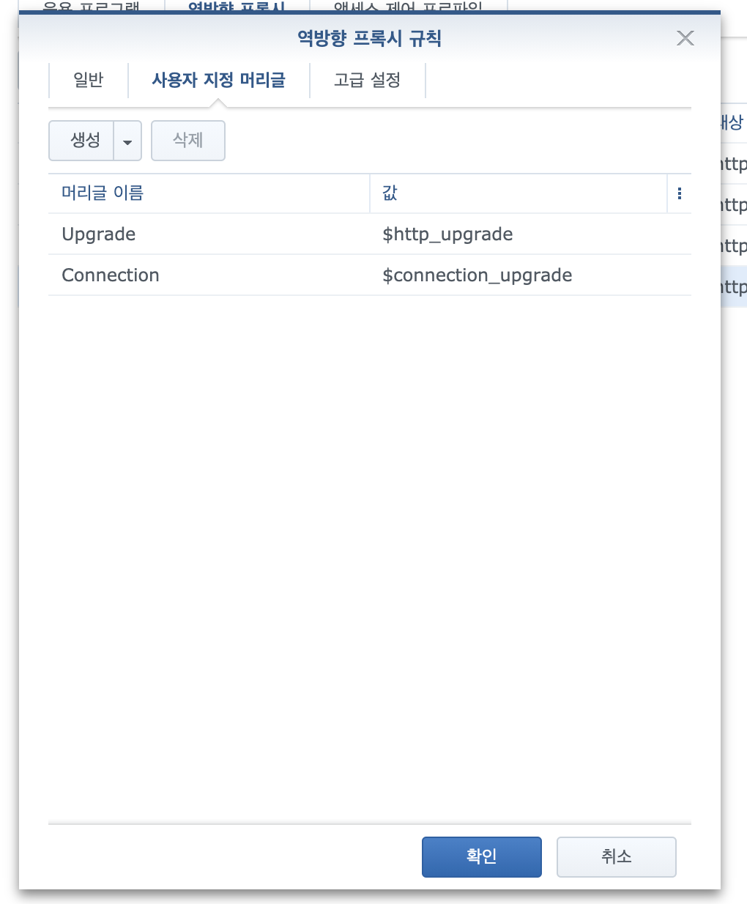

# Python

<TagLinks />

[[toc]]

## Python 배우기 좋은 사이트

- [w3schools.com](https://www.w3schools.com/python/)

## Python (on ubuntu)
> pyenv, virtualenv, autoenv

### general

```bash
# python 설치 시 발생하는 문제를 해결하기 위해 사전 패키지 설치
$ sudo apt-get install -y make build-essential libssl-dev zlib1g-dev libbz2-dev \
libreadline-dev libsqlite3-dev wget curl llvm libncurses5-dev libncursesw5-dev \
xz-utils tk-dev
```

### pyenv
> python version management

```bash
$ git clone https://github.com/pyenv/pyenv.git ~/.pyenv
$ echo 'export PYENV_ROOT="$HOME/.pyenv"' >> ~/.bash_profile
$ echo 'export PATH="$PYENV_ROOT/bin:$PATH"' >> ~/.bash_profile
$ echo 'eval "$(pyenv init -)"' >> ~/.bash_profile
$ source ~/.bash_profile
$ pyenv versions

# 필요한 버전 설치
$ pyenv install --list
$ pyenv install 3.9.0
$ pyenv shell 3.9.0
$ python -V
```

### virtualenv
> 설정 파일 및 환경 변수를 pyenv 와 함께 관리하기 위해...

```bash
$ git clone https://github.com/yyuu/pyenv-virtualenv.git ~/.pyenv/plugins/pyenv-virtualenv
$ echo 'eval "$(pyenv virtualenv-init -)"' >> ~/.bash_profile
$ source ~/.bash_profile

# 테스트 환경 만들기
$ pyenv virtualenv 3.9.0 test-env
$ pyenv versions
$ pyenv activate test-env
$ pyenv deactivate
```

### autoenv
> 특정 디렉토리로 들어가면 자동을 개발환경 전환 되도록...

```bash
$ git clone git://github.com/kennethreitz/autoenv.git ~/.autoenv
$ echo 'source ~/.autoenv/activate.sh' >> ~/.bash_profile
$ source ~/.bash_profile
$ mkdir test-dir && cd test-dir
$ touch .env
$ echo "pyenv activate test-env" > .env

$ cd test-dir
```
::: tip
- `cd ~`과 같이 홈 디렉토리에 진입할 경우 가상환경을 해제하기 위해서는 홈 디렉토리에 `.env` 파일을 만들고 아래와 같이 해서 홈 디렉토리로 가면 해제되도록 한다.
```bash
$ echo "pyenv deactivate" >> .env
```
:::

## Tip

- 작업디렉토리 변경 및 이동
  - realpath() : 심볼릭 링크등의 실제경로
  - abspath() : 절대경로
```python
import os

os.path.realpath(__file__)
os.path.abspath(__file__)
os.getcwd()
os.listdir(os.getcwd())
os.chdir("workspace")
os.system("git clone https://temp.shockz.io/shockz/temp.git")
```

- jupyter notebook 확장 설치
```bash
$ pip install jupyter_contrib_nbextensions # nbextensions 설치
$ jupyter contrib nbextension install --user # 사용 설정
```
> 2020-12-05 기준 설치한 확장  
> Code prettify, Codefolding, contrib_nbextensions_help_item, ExecuteTime, Hide input all, jupyter-js-widgets/extension, Nbextensions dashboard tab, Nbextensions edit menu item, Python Markdown, Variable Inspector

## jupyter lab docker-compose

- `docker-compose.yml` without config file path
```docker
version: '3'

services:
  jupyter:
    image: ufoym/deepo:all-cpu
    volumes:
      - /home/shockz/docker/deepo/data:/data
      - /home/shockz/docker/deepo/config:/config
    ipc: host
    ports:
      - "8888:8888"
      - "6006-6015:6006-6015"
    restart: unless-stopped
    entrypoint: sh -c 'jupyter lab --no-browser --ip=0.0.0.0 --allow-root --NotebookApp.token= --notebook-dir /data'
```
- config file generation
```bash
$ docker-compose exec jupyter bash
jupyter$ jupyter lab --generate-config
```
- jupyter password generation
```python
from notebook.auth import passwd
passwd('password', 'sha1')

```
- `jupyter_notebook_config.py`
```python
c = get_config()
c.NotebookApp.password = 'hashed password'
```
- `docker-compose.yml` with config file path
```docker
version: '3'

services:
  jupyter:
    image: ufoym/deepo:all-cpu
    volumes:
      - /home/shockz/docker/deepo/data:/data
      - /home/shockz/docker/deepo/config:/config
    ipc: host
    ports:
      - "8888:8888"
      - "6006-6015:6006-6015"
    restart: unless-stopped
    entrypoint: sh -c 'jupyter lab --no-browser --ip=0.0.0.0 --allow-root --NotebookApp.token= --notebook-dir /data --config /config/jupyter_notebook_config.py'
```

- jupyterlab synology nas reverse proxy 설정 시 웹소켓 관련 헤더 추가가 필요함


## jupyter lab docker image 에 dotnet interactive 추가하기
> [참고 repository](https://github.com/shockzinfinity/docker-build.git)

- jupyter 커널에 .net 추가를 위해 .net interactive 설치 방법
- docker file 수정
```docker{2-9,11,13}
FROM ufoym/deepo:all-cpu
ARG DEBIAN_FRONTEND=noninteractive
RUN wget https://packages.microsoft.com/config/ubuntu/18.04/packages-microsoft-prod.deb -O packages-microsoft-prod.deb && \
    dpkg -i packages-microsoft-prod.deb && \
    apt-get install -y apt-transport-https && \
    apt-get update && \
    apt-get install -y dotnet-sdk-5.0 && \
    apt-get install -y aspnetcore-runtime-5.0 && \
    dotnet tool install -g Microsoft.dotnet-interactive

ENV PATH "~/.dotnet/tools:/usr/local/bin:/usr/local/sbin:/usr/local/bin:/usr/sbin:/usr/bin:/sbin:/bin"

RUN dotnet interactive jupyter install
```
- ` docker build -t ghcr.io/shockzinfinity/deepo -f Dockerfile .` 를 이용하여 빌드 후 테스트
- ufoym/deepo:all-cpu 를 컨테이너 화 해서 dotnet interactive 를 설치하더라도 경로 문제로 인해 jupyter kernel restart 가 되지 않기 때문에 별도의 Dockerfile 을 만들어서 빌드
- jupyter lab 컨테이너를 올릴 서버에서는 docker-compose.yml 로 컨테이너 화
```docker{5}
version: '3'

services:
  jupyter:
    image: ghcr.io/shockzinfinity/deepo:latest
    volumes:
      - /home/shockz/docker/deepo/data:/data
      - /home/shockz/docker/deepo/config:/config
    ipc: host
    ports:
      - "8888:8888"
      - "6006-6015:6006-6015"
    restart: unless-stopped
    entrypoint: sh -c 'jupyter lab --no-browser --ip=0.0.0.0 --allow-root --NotebookApp.token= --notebook-dir /data --config /config/jupyter_notebook_config.py'
```
