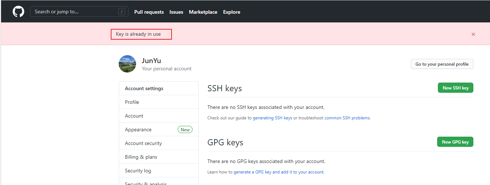
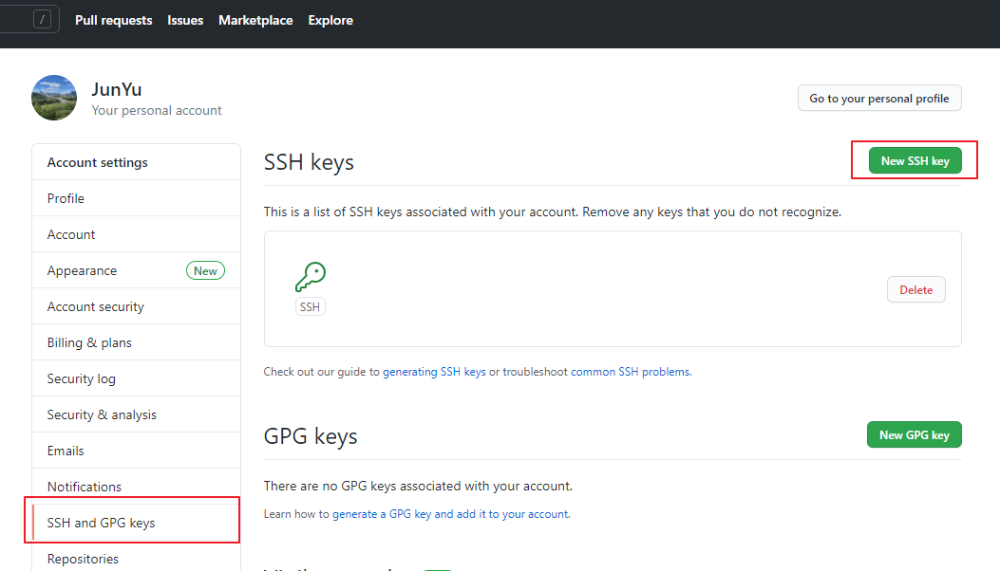
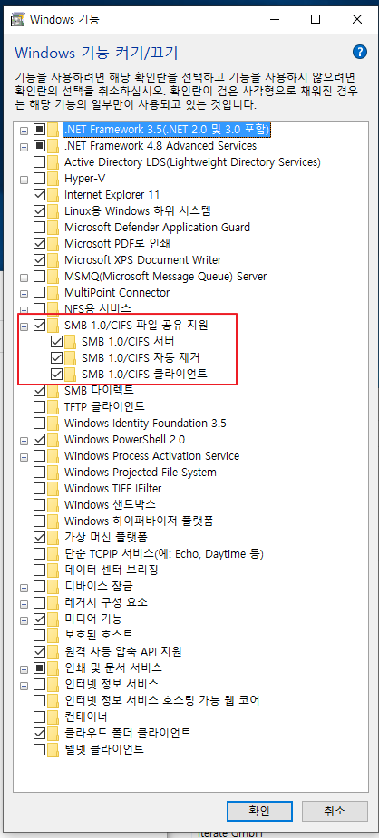

# Windows 개발 환경 구성

<TagLinks />

[[toc]]

## Cmder + Windows Terminal

- Cmder 위치
    %APPDATA%\Cmder
- 환경 변수 세팅
    CMDER_ROOT, CmdEmuDir
- UTF-8 세팅
    chcp utf-8
- 기본 환경 설정

- Windows Terminal 연계
    default setting 변경
- Windows Terminal 세팅
    기타 설정


## yarn global path 지정

```bash
$ yarn global bin
C:\Users\user\AppData\Local\Yarn\bin
```
- 해당 path를 windows path 변수에 등록


## 윈도우 10 긴 파일 이름 길이 제한 해제 설정

- gpedit.msc 실행
- `컴퓨터 구성 > 관리 템플릿 > 시스템 > 파일 시스템` 에서 `Win32 긴 경로 사용` 에서 '사용' 체크
- `gpupdate /force` 로 적용

## Powershell 관리자 권한

- 관리자 권한으로 터미널 실행
```powershell
> ExecutionPolicy
Restricted
> Set-ExecutionPolicy Unrestricted
> ExecutionPolicy
Unrestricted
```

## WSL 터미널 설정
> WSL2 Ubuntu 기준

### zsh & oh-my-zsh 설치

```bash
$ sudo apt update && sudo apt upgrade
$ sudo apt install git zsh

# chsh 수동 (필요한 경우)
$ sudo chsh -s $(which zsh)

# oh-my-zsh 설치
$ sh -c "$(curl -fsSL https://raw.githubusercontent.com/ohmyzsh/ohmyzsh/master/tools/install.sh)"
```

### wsl LS_COLOR 조정

```bash
# .zshrc 에 아래 추가
LS_COLORS="ow=01;36;40" && export LS_COLORS
```

### zsh-completions, zsh-syntax-highlighting, zsh-autosuggestions

```bash
$ cd ~
$ git clone https://github.com/zsh-users/zsh-completions ${ZSH_CUSTOM:=~/.oh-my-zsh/custom}/plugins/zsh-completions

# .zshrc plugins 부분에 추가
plugins = (
  ...
  zsh-completions
  ...
)

$ autoload -U compinit && compinit

# zsh-syntax-highlighting
$ git clone https://github.com/zsh-users/zsh-syntax-highlighting.git ${ZSH_CUSTOM:=~/.oh-my-zsh/custom}/plugins/zsh-syntax-highlighting
# zsh-autosuggestions
$ git clone https://github.com/zsh-users/zsh-autosuggestions ${ZSH_CUSTOM:=~/.oh-my-zsh/custom}/plugins/zsh-autosuggestions

# .zshrc plugins
plugins=(
  ...
  zsh-completions
  zsh-syntax-highlighting
  zsh-autosuggestions
)
```

### powerlevel10k theme

```bash
$ git clone https://github.com/romkatv/powerlevel10k.git  $ZSH_CUSTOM/themes/powerlevel10k

# .zshrc theme
ZSH_THEME="powerlevel10k/powerlevel10k"

# NerdFonts
# https://github.com/romkatv/dotfiles-public/.local/share/fonts/NerdFonts

$ p10k configure
```

### neovim

```bash
$ sudo apt install neovim
$ curl -sLf https://spacevim.org/install.sh | bash

# .zshrc alias
alias vim="nvim"
alias vi="nvim"
alias vimdiff="nvim -d"
export EDITOR=/usr/bin/nvim

$ mkdir ~/.SpaceVim.d/colors
# ADD snazzy colorscheme download

# ~/.SpaceVim.d/init.toml 수정
[options]
  colorscheme = "snazzy-custom"
  enable_guicolors = true
  statusline_separator = "arrow"
  enable_tabline_filetype_icon = true
  enable_statusline_mode = true
  statusline_unicode_symbols = true
```

### fzf, fasd, tig, jq, neofetch

```bash
$ sudo apt install fzf fasd tig jq neofetch
```

### nvm in wsl

- [https://github.com/nvm-sh/nvm](https://github.com/nvm-sh/nvm)
- `sudo curl -o- https://raw.githubusercontent.com/nvm-sh/nvm/v0.39.0/install.sh | bash`
```bash
$ nvm --version
$ nvm ls-remote
$ nvm install v12.21.0
$ nvm use v12.21.0
```

### nvm in windows command

- [https://github.com/coreybutler/nvm-windows/releases](https://github.com/coreybutler/nvm-windows/releases)
- `nvm use 12.22.7` 과 같이 실행할 경우는 cmd 를 관리자 권한으로 실행한 후 해당 커맨드를 실행해야 함 (2021.10.15 현재 nvm-windows 를 설치했을 경우 elevation.cmd 혹은 elevation.vbs 가 정상적으로 실행이 안되는 것을 보임)
- `use` 의 경우만 관리자 권한에서 실행하면 되고, 그 후는 일반 cmd 권한에서도 동작함
```cmd{4}
> nvm --version
> nvm list
> nvm install 12
> nmv use 12.22.7
```

### Windows Terminal settings

- `...\AppData\Local\Packages\Microsoft.WindowsTerminal_8wekyb3d8bbwe\RoamingState\sitecore-theme` 에 `Sitecore-Dark2.png`, `sitecore-icon.png` 복사
- 참고: [https://terminalsplash.com/](https://terminalsplash.com/)
```json
{
  "defaultProfile": "{2c4de342-38b7-51cf-b940-2309a097f518}",
  "profiles": {
    "defaults": {
      // Put settings here that you want to apply to all profiles.
    },
    "list": [
      ...,
      {
        "guid": "{2c4de342-38b7-51cf-b940-2309a097f518}",
        "hidden": false,
        "fontFace": "MesloLGS NF",
        "fontSize": 9,
        "name": "Ubuntu",
        "source": "Windows.Terminal.Wsl",
        "backgroundImage": "ms-appdata:///roaming/sitecore-theme/Sitecore-Dark2.png",
        "backgroundImageOpacity": 0.80000001192092896,
        "backgroundImageStretchMode": "uniformToFill",
        "icon": "ms-appdata:///roaming/sitecore-theme/sitecore-icon.png",
        "colorScheme": "wsl"
      },
      ...
    ],
  },
    "schemes": [
    {
      "name": "Aurelia",
      "background": "#1a1a1a",
      "black": "#000000",
      "blue": "#579BD5",
      "brightBlack": "#797979",
      "brightBlue": "#9CDCFE",
      "brightCyan": "#2BC4E2",
      "brightGreen": "#1AD69C",
      "brightPurple": "#975EAB",
      "brightRed": "#EB2A88",
      "brightWhite": "#EAEAEA",
      "brightYellow": "#e9ad95",
      "cyan": "#00B6D6",
      "foreground": "#EA549F",
      "green": "#4EC9B0",
      "purple": "#714896",
      "red": "#E92888",
      "white": "#EAEAEA",
      "yellow": "#CE9178"
    },
    {
      "name": "wsl",
      "background": "#002B36",
      "black": "#002B36",
      "blue": "#268BD2",
      "brightBlack": "#657B83",
      "brightBlue": "#839496",
      "brightCyan": "#D33682",
      "brightGreen": "#B58900",
      "brightPurple": "#EEE8D5",
      "brightRed": "#CB4B16",
      "brightWhite": "#FDF6E3",
      "brightYellow": "#586E75",
      "cyan": "#2AA198",
      "foreground": "#93A1A1",
      "green": "#859900",
      "purple": "#6C71C4",
      "red": "#DC322F",
      "white": "#93A1A1",
      "yellow": "#B58900"
    }
  ],
}
```

## wsl, php, xdebug, vscode

- TODO: WSL 설치
- TODO: VisualStudio Code Terminal 설정
- WSL 설정 (Ubuntu 20.04 기준)
```bash
$ sudo apt update && sudo apt upgrade
$ sudo apt-cache policy nginx
$ sudo apt update
$ sudo apt-get update
$ sudo apt install nginx
$ nginx -v
$ sudo chown -R www-data:ubuntu /var/www/
$ sudo apt install php7.4 php7.4-cli php7.4-fpm php7.4-bcmath php7.4-bz2 php7.4-common php7.4-curl php7.4-dba php7.4-gd php7.4-json php7.4-mbstring php7.4-opcache php7.$ 4-readline php7.4-soap php7.4-xml php7.4-xmlrpc php7.4-zip php-redis php7.4-mysql php-imagick php7.4-intl php7.4-mysql php7.4-gmp php-geoip php7.4-dev -y
$ php -v
$ sudo nginx -t
$ sudo systemctl reload nginx
$ sudo service nginx restart
$ sudo service php7.4-fpm start
$ sudo apt install mariadb-client-core-10.3

```
- `/etc/php/7.4/fpm/php.ini` 설정
```ini
max_execution_time = 1800
max_input_vars = 10000
memory_limit = 256M
post_max_size = 200M
upload_max_filesize = 200M
```
- `/etc/nginx/sites-available/default` 설정
```ini
server {
  root /var/www/html;
  index index.php index.html index.htm index.nginx-debian.html;
  server_name shockz-amd.test;
  server_tokens off;
  client_max_body_size 100M;
  add_header X-Frame-Options "SAMEORIGIN" always;
  add_header X-XSS-Protection "1; mode=block" always;
  add_header X-Content-Type-Options "nosniff" always;
  add_header Referrer-Policy "no-referrer-when-downgrade" always;
  add_header Content-Security-Policy "default-src * data: 'unsafe-eval' 'unsafe-inline'" always;

  location = /robots.txt {
                add_header Content-Type text/plain;
                return 200 "User-agent: *\nDisallow: /\n";
  }
  location / {
    try_files $uri $uri/ =404;
    if (!-e $request_filename) {
      rewrite ^.*$ /index.php last;
    }
  }
  location ~ \.php$ {
    include snippets/fastcgi-php.conf;
    fastcgi_pass unix:/var/run/php/php7.4-fpm.sock;
    fastcgi_param SCRIPT_FILENAME $document_root$fastcgi_script_name;
    include fastcgi_params;
    fastcgi_read_timeout 300;
  }
  location ~ /\.ht {
    deny all;
  }
  location = /favicon.ico {
    log_not_found off; access_log off;
  }
  location ~* \.(css|gif|ico|jpeg|jpg|js|png)$ {
    expires max;
    log_not_found off;
  }
}
```
- `/var/www/html` 권한 조정
```bash
$ sudo chown -R www-data:usergroup /var/www/html/
$ sudo chmod -R 775 /var/www/html/
```
- `/var/www/html/index.php` 작성
```php
<?php phpinfo(); ?>
```
- xdebug 설치
```bash
$ sudo apt install php-pear php-dev
$ sudo pecl install xdebug
...
Build complete.
Don't forget to run 'make test'.

running: make INSTALL_ROOT="/tmp/pear/temp/pear-build-rootaAavFR/install-xdebug-3.0.3" install
Makefile:228: warning: overriding recipe for target 'test'
Makefile:132: warning: ignoring old recipe for target 'test'
Installing shared extensions:     /tmp/pear/temp/pear-build-rootaAavFR/install-xdebug-3.0.3/usr/lib/php/20190902/

  +----------------------------------------------------------------------+
  |                                                                      |
  |   INSTALLATION INSTRUCTIONS                                          |
  |   =========================                                          |
  |                                                                      |
  |   See https://xdebug.org/install.php#configure-php for instructions  |
  |   on how to enable Xdebug for PHP.                                   |
  |                                                                      |
  |   Documentation is available online as well:                         |
  |   - A list of all settings:  https://xdebug.org/docs-settings.php    |
  |   - A list of all functions: https://xdebug.org/docs-functions.php   |
  |   - Profiling instructions:  https://xdebug.org/docs-profiling2.php  |
  |   - Remote debugging:        https://xdebug.org/docs-debugger.php    |
  |                                                                      |
  |                                                                      |
  |   NOTE: Please disregard the message                                 |
  |       You should add "extension=xdebug.so" to php.ini                |
  |   that is emitted by the PECL installer. This does not work for      |
  |   Xdebug.                                                            |
  |                                                                      |
  +----------------------------------------------------------------------+


running: find "/tmp/pear/temp/pear-build-rootaAavFR/install-xdebug-3.0.3" | xargs ls -dils
76224    4 drwxr-xr-x 3 root root    4096 Mar 21 17:19 /tmp/pear/temp/pear-build-rootaAavFR/install-xdebug-3.0.3
76334    4 drwxr-xr-x 3 root root    4096 Mar 21 17:19 /tmp/pear/temp/pear-build-rootaAavFR/install-xdebug-3.0.3/usr
76335    4 drwxr-xr-x 3 root root    4096 Mar 21 17:19 /tmp/pear/temp/pear-build-rootaAavFR/install-xdebug-3.0.3/usr/lib
76336    4 drwxr-xr-x 3 root root    4096 Mar 21 17:19 /tmp/pear/temp/pear-build-rootaAavFR/install-xdebug-3.0.3/usr/lib/php
76337    4 drwxr-xr-x 2 root root    4096 Mar 21 17:19 /tmp/pear/temp/pear-build-rootaAavFR/install-xdebug-3.0.3/usr/lib/php/20190902
76332 2396 -rwxr-xr-x 1 root root 2451512 Mar 21 17:19 /tmp/pear/temp/pear-build-rootaAavFR/install-xdebug-3.0.3/usr/lib/php/20190902/xdebug.so

Build process completed successfully
Installing '/usr/lib/php/20190902/xdebug.so'
install ok: channel://pecl.php.net/xdebug-3.0.3
configuration option "php_ini" is not set to php.ini location
You should add "zend_extension=/usr/lib/php/20190902/xdebug.so" to php.ini
```
- `/etc/php/7.4/fpm/php.ini` 끝에 xdebug 관련 설정 추가
```ini
...
[XDEBUG]
zend_extension=/usr/lib/php/20190902/xdebug.so
xdebug.remote_enable = 1
xdebug.remote_autostart = 1
xdebug.remote_port = 9000
```
```bash
$ sudo service nginx restart
$ sudo service php7.4-fpm restart
```

- vscode debug 설정

- `/var/www/html/.vscode/launch.json` 설정 추가
```json
{
  // IntelliSense를 사용하여 가능한 특성에 대해 알아보세요.
  // 기존 특성에 대한 설명을 보려면 가리킵니다.
  // 자세한 내용을 보려면 https://go.microsoft.com/fwlink/?linkid=830387을(를) 방문하세요.
  "version": "0.2.0",
  "configurations": [
    {
      "name": "Listen for XDebug",
      "type": "php",
      "request": "launch",
      "port": 9000
    },
    {
      "name": "Launch currently open script",
      "type": "php",
      "request": "launch",
      "program": "${file}",
      "cwd": "${fileDirname}",
      "port": 9000
    }
  ]
}
```

### SSL 적용

- 자체 서명 인증서 생성하고 `/etc/ssl/certs/shockz-amd.test.crt` `/etc/ssl/private/shockz-amd.test.key` 로 복사
```bash
$ openssl req -x509 -newkey rsa:4096 -sha256 -days 3650 -nodes -keyout shockz-amd.test.key -out shockz-amd.test.crt -subj "/CN=shockz-amd.test" -addext "subjectAltName=DNS:shockz-amd.test"
$ sudo cp shockz-amd.test.crt /etc/ssl/certs/shockz-amd.test.crt
$ sudo cp shockz-amd.test.key /etc/ssl/private/shockz-amd.test.key
```
- `/etc/nginx/sites-available/default` 에 적용
```ini
server {
  root /var/www/html;

  index index.php index.html index.htm index.nginx-debian.html;

  server_name shockz-amd.test;
  server_tokens off;
  client_max_body_size 100M;
  add_header X-Frame-Options "SAMEORIGIN" always;
  add_header X-XSS-Protection "1; mode=block" always;
  add_header X-Content-Type-Options "nosniff" always;
  add_header Referrer-Policy "no-referrer-when-downgrade" always;
  add_header Content-Security-Policy "default-src * data: 'unsafe-eval' 'unsafe-inline'" always;

  location = /robots.txt {
    add_header Content-Type text/plain;
    return 200 "User-agent: *\nDisallow: /\n";
  }

  location / {
    try_files $uri $uri/ =404;
    if (!-e $request_filename) {
      rewrite ^.*$ /index.php last;
    }
  }

  location ~ \.php$ {
    include snippets/fastcgi-php.conf;
    fastcgi_pass unix:/var/run/php/php7.4-fpm.sock;
    fastcgi_param SCRIPT_FILENAME $document_root$fastcgi_script_name;
    include fastcgi_params;
    fastcgi_read_timeout 300;
  }

  location ~ /\.ht {
    deny all;
  }

  location = /favicon.ico {
    log_not_found off; access_log off;
  }

  location ~* \.(css|gif|ico|jpeg|jpg|js|png)$ {
    expires max;
    log_not_found off;
  }

  listen [::]:443 ssl ipv6only=on;
  listen 443 ssl;
  ssl_certificate /etc/ssl/certs/shockz-amd.test.crt;
  ssl_certificate_key /etc/ssl/private/shockz-amd.test.key;
}

server {
  if ($host = shockz-amd.test) {
    return 301 https://$host$request_uri;
  }
  listen 80 default_server;
  listen [::]:80 default_server;
  server_name shockz-amd.test;
  return 404;
}
```

## ssh key 를 통한 비밀번호 없이 접속

- git bash 등이 설치가 되면 `ssh-keygen` 이 같이 설치됨
```bash
$ ssh-keygen -t rsa
# 비밀번호 입력 필요
```
- `C:\Users\userid\.ssh` 에 `id_rsa`, `id_rsa.pub` 파일이 생성됨.
- id_rsa : private
- id_rsa.pu : public
- public 을 접속하고자 하는 ssh 에 복사하고, 연결하고자 하는 클라이언트에서 private 을 이용해 접속
```bash
# WSL 환경 기준
$ cd /mnt/c/Users/myid/.ssh
$ ssh-copy-id -i ./id_rsa.pub userid@address -p <port>

# 이후 접속부터는 아래를 통해 접속 가능
$ ssh -i /path/id_rsa userid@address -p <port>
```

## github multiple ssh key

> 개발 환경 구성 시 여러 github 계정을 사용할 경우
> 각 github 계정 별 ssh key 등록이 필요하다.
> 별도 설정 없이 ssh 키를 여러 곳에서 사용할 경우 'Key is already in use' 에러를 볼 수 있다.


#### 1. 각 계정별 ssh key 생성

```bash
> ssh-keygen -t rsa -b 4096 -C "github@login.email" -f id_rsa_name # 계정별로 생성
```
  이메일 별로 `id_rsa_name`, `id_rsa_name.pub` 로 생성됨

#### 2. github 에 등록

- [Settings] > [SSH and GPG keys] > SSH keys / New SSH key 로 등록 (각 계정별)
- `.pub` 키를 등록


#### 3. ~/.ssh/config 설정

- `config` 파일이 없다면 생성하여 수정
```bash
# ironpot42.com - github
Host temp1-github.com
  HostName github.com
  User git
  IdentityFile C:\\Users\\somebody\\.ssh\\id_rsa_temp1

# temp2 - github
Host temp2-github.com
  HostName github.com
  User git
  IdentityFile C:\\Users\\somebody\\.ssh\\id_rsa_temp2

# tmep3 - github
Host temp3-github.com
  HostName github.com
  User git
  IdentityFile C:\\Users\\somebody\\.ssh\\id_rsa_temp3
```
- `Host` : 임의의 이름
- `HostName` : github.com 서버 대상이므로 고정
- `User` : github ssh 는 **git** 으로 고정
- 저장 후 연결 테스트
```bash
> ssh -T temp1-github.com
Hi temp1! You've successfully authenticated, but GitHub does not provide shell access.

> ssh -T temp2-github.com
Hi temp2! You've successfully authenticated, but GitHub does not provide shell access.

> ssh -T temp3-github.com
Hi temp3! You've successfully authenticated, but GitHub does not provide shell access.
```

#### 4. ~/.gitconfig 설정

- `.gitconfig` 전역 파일 수정
```bash
[core]
        editor = \"C:\\Users\\somebody\\AppData\\Local\\Programs\\Microsoft VS Code\\Code.exe\" --wait
[user]
        name = Temp 1
        email = github@login.email
[includeIf "gitdir:C:/temp2/"]
        path = .gitconfig-temp2
[includeIf "gitdir:C:/temp3/"]
        path = .gitconfig-temp3
```
- **[includeIf "gitdir:C:/temp2/"]** 는 `C:/temp2` 디렉토리 아래에서는 `.gitconfig-temp2` 가 적용됨을 뜻함.
- Windows 에서도 linux 스타일 path를 지정해야 동작
- `.gitconfig-temp2`, `.gitconfig-temp3` 을 생성하여 내용 추가
```bash
[user]
        name = temp2
        email = temp2.github@login.email
```
- `C:/temp2` 아래에서 repository 를 생성하거나 클론하여 `git config --list` 로 확인
```bash
...
user.email=github@login.email
user.name=Temp 1
includeif.gitdir:C:/temp2/.path=.gitconfig-temp2
user.email=temp2.github@login.email
user.name=temp2
...
```
- `includeif.gitdir:C:/temp2/.path=.gitconfig-temp2` 가 적용되므로 `.gitconfig-temp2`를 불러와서 user.email, user.name 이 적용됨

#### 5. private repository

- `.ssh/config` 에서 설정한 HostName 을 이용하여 clone
- `git clone temp2-github.com:[계정명]/[repository]` 와 같은 형식으로 클론
```bash
> git clone temp2-github.com:temp2/repository.git
```

#### 참고. ssh-agent 관련

- ssh-agent 에 여러 키를 등록하여 사용하고자 할 경우
```bash
> ssh-add %HOME%/.ssh/id_rsa_temp2
unable to start ssh-agent service, error :1058
```
- 위의 에러시에는 **OpenSSH Authentication Agent** 서비스 동작을 확인

- 여러 키를 사용하는 상황에서는 ssh 를 사용하지 않는 repository 에서 등록되지 않은 키를 잘못 사용하고 있다라고 하면서 접속이 되지 않는 경우가 있음.
- ssh-agent 에서 전부 삭제하여 ~/.ssh/config 를 사용하도록 설정하거나, 모든 키를 사전에 등록하여 사용
```bash
# 키 등록
> ssh-add %HOME%/.ssh/id_rsa_temp2
# 등록된 키 확인
> ssh-add -l
# 등록된 키 모두 삭제
> ssh-add -D
```

- 기존 repository 에서 ssh 키로 변경된 remote 로 변경 시 아래와 같이 변경
```bash
>  git remote set-url origin git@temp2-github.com:temp2/address.git
```

## SMB/CIFS 연결 안될때 체크



## cmd 한글 깨지는 현상 (code page)

- 한글 확장 완성형: 949
- UTF-8: 65001
- REGISTRY 등록: HKEY_LOCAL_MACHINE\SYSTEM\CurrentControlSet\Control\Nls\CodePage
  OEMCP 949 -> 65001

```cmd
> chcp
> chcp 949
> chcp 65001
```

## WSL 에서 Windows font 사용

- `/etc/fonts/fonts.conf` 에 Windows Font 경로 추가
```xml
<!-- Font directory list -->
  <dir>/usr/share/fonts</dir>
  <dir>/usr/local/share/fonts</dir>
  <dir prefix="xdg">fonts</dir>
  <!-- the following element will be removed in the future -->
  <dir>~/.fonts</dir>
  <dir>/mn/c/Windows/Fonts</dir>
```

## windows batch script

- [https://velog.io/@springkim/windows-batch-script](https://velog.io/@springkim/windows-batch-script)
- [https://kukuta.tistory.com/232](https://kukuta.tistory.com/232)
