# Todo App Tutorial

<TagLinks />

> 부제: Todo App 을 만드는 복잡한 방법  
> [Github Repository](https://github.com/shockzinfinity/todo-api-complicated)

[[toc]]

---

## 개요

> Todo App을 다양한 기술 스택을 이용하여 구현

## Tools (Prerequisite)

- ASP.NET core 3.1
- MS SQL Server 2019
- Docker
- Nginx
- SSL
- Swagger (Not yet)
- Seq (Not yet)
- FluntValidation (Not yet)
- Automapper (Not yet)
- CQRS (Not yet)
- Vue.js (Not yet)

## Step

### Create Web API

- [dotnet core sdk](https://dotnet.microsoft.com/download) 설치 (Windows)
   mac 혹은 linux 에서 sdk 설치는 [dotnet core in CentOS 8 & mac](../dev-log/dotnetcore) 참조
- IDE Tools:
   [Visual Studio Code](https://code.visualstudio.com/) + C# extensions 또는  
   [Visual Studio 2019 Community](https://visualstudio.microsoft.com/ko/vs/)
```bash
$ mkdir todoCore3 && cd todoCore3
$ dotnet new sln --name todoCore3
$ dotnet new webapi --name todoCore3.Api
$ dotnet sln add todoCore3.Api/todoCore3.Api.csproj
```

- 추후 db 연결을 위하여 패키지 미리 설치
```bash
$ dotnet add package Microsoft.EntityFrameworkCore.SqlServer
$ dotnet add package Microsoft.EntityFrameworkCore.InMemory
```

- Ctrl+F5 등으로 앱 실행 후 브라우저에서 `https://localhost:5001/weatherforecast` 접속
- `.gitignore` 추가 후 git repository 초기화
- [gitignore github](https://github.com/github/gitignore) 참조
```bash
$ git init
$ git remote add origin https://git.shockz.io/shockz/todocore3.git
$ git add .
$ git commit -m "Initial commit"
$ git push -u origin master
$ git lfs install
$ git flow init
```

- `Startup.cs` 수정
  - Configure 메서드 내의 **app.UseHttpsRedirection();** 제거
  - ForwardHeaders 삽입
```csharp
app.UseForwardedHeaders(new ForwardedHeadersOptions
{
    ForwardedHeaders = ForwardedHeaders.XForwardedFor | ForwardedHeaders.XForwardedProto
});
```
::: tip
Nginx 와 연결되는 docker container 환경과 비슷하게 하기 위하여 Visual Studio 사용하여 디버깅 할 경우,  
Kestrel 웹서버 방식으로 테스트  
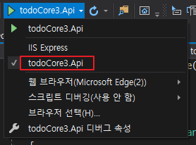  
참고: [ASP.NET Core에서 Kestrel 웹 서버 구현](https://docs.microsoft.com/ko-kr/aspnet/core/fundamentals/servers/kestrel?view=aspnetcore-3.1)
:::

- [Postman](https://www.postman.com/downloads/) 등으로 기본 테스트
   
- `TodoItem.cs` 모델을 `Models` 폴더에 추가
```csharp
namespace todoCore3.Api.Models
{
	public class TodoItem
	{
		public long Id { get; set; }
		public string Name { get; set; }
		public bool IsCompleted { get; set; }
	}
}
```
- `TodoContext.cs` 추가
```csharp
using Microsoft.EntityFrameworkCore;

namespace todoCore3.Api.Models
{
	public class TodoContext : DbContext
	{
		public TodoContext(DbContextOptions<TodoContext> options) : base(options)
		{
		}

		public DbSet<TodoItem> TodoItems { get; set; }
	}
}
```
- SQL Server DbContext 마이그레이션을 위한 sql container 생성 ([참조](../dev-log/mssql))
   - 테스트 및 Todo Api 내에서 connection string 단순화를 위해 docker network 생성 및 연결 (`todo-core` network)
   - data 보존을 위해 docker data volume 생성
   - 테스트의 편의성을 위해 기본 port 로 진행  
      (port 변경 시 container 간 network는 추가 작업이 필요함)
```bash
# network 생성
$ docker network create todo-core
$ docker network ls

# volume 생성
$ docker volume create sql_data
$ docker volume ls

# sql container run
$ docker run -d -p 1433:1433 -e "ACCEPT_EULA=Y" -e "SA_PASSWORD=y0urStrong!Password" --network=todo-core --name sql -v sql_data:/var/opt/mssql mcr.microsoft.com/mssql/server:2019-latest

# 추후 백업을 위한 디렉토리 생성
$ docker exec -d sql2 mkdir /var/opt/mssql/backup
```

- Api 시작 시 db migration 을 위한 작업
   - `Startup.cs` 의 `ConfigureServices()`에 **DbContext** DI(종속성 주입)
   - 프로젝트에 EntityFrameworkCore.Design 추가
      `dotnet add package Microsoft.EntityFrameworkCore.Design`
   - ef core cli 설치
   - migration 생성 ([패키지 관리자 콘솔](https://docs.microsoft.com/ko-kr/ef/core/miscellaneous/cli/powershell) 혹은 CLI 이용), 여기서는 CLI 이용
```csharp{14-23}
public void ConfigureServices(IServiceCollection services)
{
  services.AddDbContext<TodoContext>(opt => opt.UseSqlServer("Data Source=localhost;Database=todos;Integrated Security=false;User ID=sa;Password=y0urStrong!Password;"));
  ...
}

// container 시작 시에 자동 migration을 위해 설정
// 자동 마이그레이션을 사용하지 않을 경우 CLI 를 통해 migration 추가 및 update
// NOTE: 이 방법은 nginx 를 통한 reverse proxy 를 사용하게 되면 제거해야 함.
// docker-compose 로 api container 가 동시에 시작이 될 경우 문제가 될 수 있음
public void Configure(IApplicationBuilder app, IWebHostEnvironment env)
{
   ...
   using (var serviceScope = app.ApplicationServices.GetRequiredService<IServiceScopeFactory>().CreateScope())
   {
      var context = serviceScope.ServiceProvider.GetService<TodoContext>();

      if (context.Database.GetPendingMigrations().Any())
      {
         // DB update migrations
         context.Database.Migrate();
      }
   }
   ...
}
```
```bash
# ef core 를 위한 tool 업데이트
$ dotnet tool install --global dotnet-ef
# or
$ dotnet tool update -g dotnet-ef

# migration 생성
$ dotnet ef migrations add CreateTodoItem --project todoCore3.Api.csproj
# migration 취소
$ dotnet ef migrations remove
# db update
$ dotnet ef database update --project todoCore3.Api.csproj
```
- 생성확인
   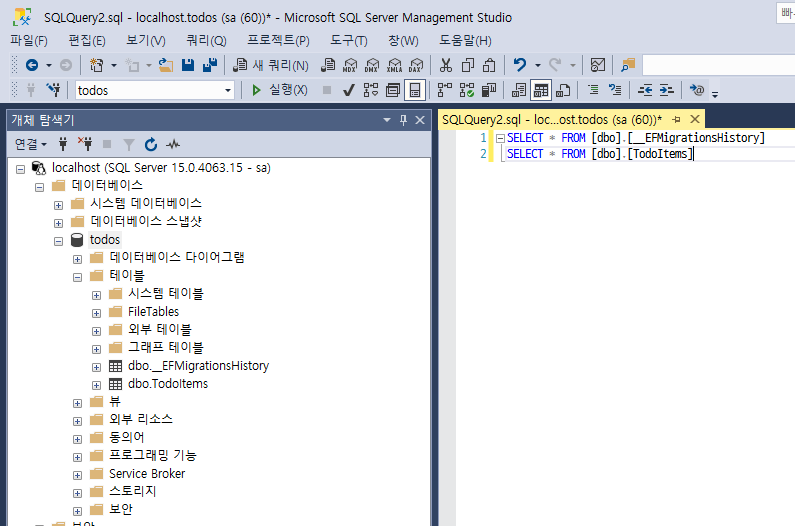
   

- api Controller scaffolding
```bash
$ dotnet add package Microsoft.VisualStudio.Web.CodeGeneration.Design
$ dotnet tool install --global dotnet-aspnet-codegenerator
$ dotnet tool update -g dotnet-aspnet-codegenerator
$ dotnet aspnet-codegenerator controller -name TodoItemsController -async -api -m TodoItem -dc TodoContext -outDir Controllers
```

- POST method 조정
```csharp{9}
// POST: api/TodoItems
[HttpPost]
public async Task<ActionResult<TodoItem>> PostTodoItem(TodoItem todoItem)
{
  _context.TodoItems.Add(todoItem);
  await _context.SaveChangesAsync();

  //return CreatedAtAction("GetTodoItem", new { id = todoItem.Id }, todoItem);
  return CreatedAtAction(nameof(GetTodoItem), new { id = todoItem.Id }, todoItem);
}
```

- Postman 확인
```json
{
  "name": "test Todo 1",
  "IsCompleted": false
}
```
   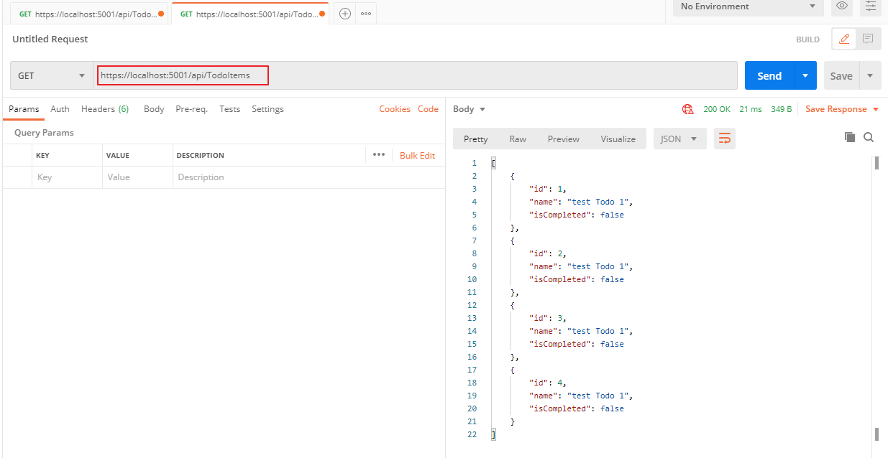
   

::: warning
Controller endpoint 의 DTO 사용은 추후 업데이트 예정 (2020.9.9)
:::

### Dockerize

- `Api.Dockerfile` 을 프로젝트 폴더에 추가
```docker
FROM mcr.microsoft.com/dotnet/core/aspnet:3.1 AS base
WORKDIR /app

FROM mcr.microsoft.com/dotnet/core/sdk:3.1 AS build
WORKDIR /src
COPY ["todoCore3.Api.csproj", "./"]
RUN dotnet restore "./todoCore3.Api.csproj"
COPY . .
WORKDIR "/src/."
RUN dotnet build "todoCore3.Api.csproj" -c Release -o /app/build

FROM build AS publish
RUN dotnet publish "todoCore3.Api.csproj" -c Release -o /app/publish

FROM base AS final
WORKDIR /app
COPY --from=publish /app/publish .
ENV ASPNETCORE_URLS http://*:5000
ENTRYPOINT ["dotnet", "todoCore3.Api.dll"]
```

- docker container 간 network 설정을 하게 되므로 연결 문자열 변경  
   `Data Source=(docker container name);Database=todos;Integrated Security=false;User ID=sa;Password=y0urStrong!Password;`
```csharp{3}
public void ConfigureServices(IServiceCollection services)
{
  services.AddDbContext<TodoContext>(opt => opt.UseSqlServer("Data Source=sql;Database=todos;Integrated Security=false;User ID=sa;Password=y0urStrong!Password;"));
  ...
}
```

- api build & run
```bash
$ docker build -t todo-api -f Api.Dockerfile .
$ docker run -d -p 5000:5000 --network=todo-core --name todo-api todo-api
```
   
   

### Nginx reverse proxy

- 솔루션 폴더에 Nginx 폴더 추가 후 `Nginx.Dockerfile`, `nginx.conf` 생성
```bash
$ mkdir Nginx && cd Nginx
$ touch Nginx.Dockerfile nginx.conf
```

- **Nginx.Dockerfile**
```docker
FROM nginx:latest

COPY nginx.conf /etc/nginx/nginx.conf
```
- **nginx.conf**
```bash
worker_processes auto;

events { worker_connections 2048; }

http {
  sendfile on;

  upstream web-api {
    server api_1:5000; # docker-compose 에서 사용될 service 이름
  }

  server {
    listen 80;
    server_name $hostname;
    location / {
      proxy_pass         http://web-api;
      proxy_redirect     off;
      proxy_http_version 1.1;
      proxy_cache_bypass $http_upgrade;
      proxy_set_header   Upgrade $http_upgrade;
      proxy_set_header   Connection keep-alive;
      proxy_set_header   Host $host;
      proxy_set_header   X-Real-IP $remote_addr;
      proxy_set_header   X-Forwarded-For $proxy_add_x_forwarded_for;
      proxy_set_header   X-Forwarded-Proto $scheme;
      proxy_set_header   X-Forwarded-Host $server_name;
    }
  }
}
```
- 솔루션 폴더에 `docker-compose.yml` 추가
```docker
version: "3.7"

services:
  sql:
    image: mcr.microsoft.com/mssql/server:2019-latest
    ports:
      - "1433:1433"
    volumes:
      - "sql_data:/var/opt/mssql"
    environment:
      ACCEPT_EULA: "Y"
      SA_PASSWORD: "y0urStrong!Password"
    restart: "no"

  nginx:
    depends_on:
      - sql
      - api_1
    build:
      context: ./Nginx
      dockerfile: Nginx.Dockerfile
    ports:
      - "4000:80"
    restart: "no"

  api_1:
    depends_on:
      - sql
    build:
      context: ./todoCore3.Api
      dockerfile: Api.Dockerfile
    expose:
      - "5000"
    restart: "no"

volumes:
  sql_data:
```
::: warning
[wait-for-it.sh](https://github.com/vishnubob/wait-for-it/)  
> 특정 서버의 특정 포트로 접근이 가능할때까지 프로세스를 홀딩하는 스크립트  
sql container가 초기화 될때까지 대기하고 있다가 api 가 실행되게 하기 위해서 120초 대기하다가 실행되도록 함  
`Api.Dockerfile`을 수정
```docker{19-21}
FROM mcr.microsoft.com/dotnet/core/aspnet:3.1 AS base
WORKDIR /app

FROM mcr.microsoft.com/dotnet/core/sdk:3.1 AS build
WORKDIR /src
COPY ["todoCore3.Api.csproj", "./"]
RUN dotnet restore "./todoCore3.Api.csproj"
COPY . .
WORKDIR "/src/."
RUN dotnet build "todoCore3.Api.csproj" -c Release -o /app/build

FROM build AS publish
RUN dotnet publish "todoCore3.Api.csproj" -c Release -o /app/publish

FROM base AS final
WORKDIR /app
COPY --from=publish /app/publish .
ENV ASPNETCORE_URLS http://*:5000
COPY ./wait-for-it.sh /wait-for-it.sh
RUN chmod +x /wait-for-it.sh
ENTRYPOINT ["/wait-for-it.sh", "sql:1433", "-t", "120", "--", "dotnet", "todoCore3.Api.dll"]
```
:::

::: danger
`docker-compose up --build` 로 최초 실행 시
`TodoContext` 에 대한 마이그레이션이 업데이트 되기 전인 상태가 되므로
`Startup.cs/Configure()` 메서드 내의 **Migration** 관련 코드를 제거하고,
컨테이너가 실행되는 시점에서 db migration 방법이 필요함
:::
- docker-compose 로 실행
```bash
$ docker-compose up --build
```
- Postman 으로 테스트
   
   
   

### SSL 적용

- dotnet SDK 를 설치하거나 Visual Studio 를 통해 디버깅을 하게 되면 보통 자체 서명 인증서 등록되어 있음  
   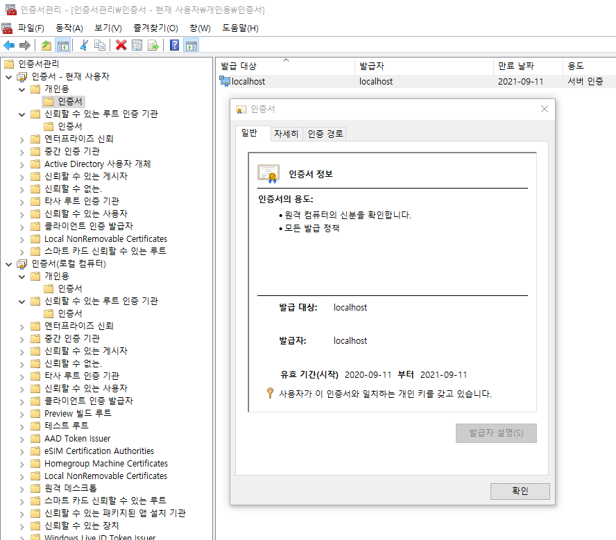
   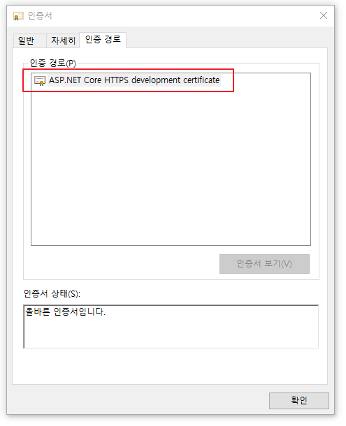
- `localhost.pfx`로 *내보내기* 후 **Nginx** 폴더에 저장
   
   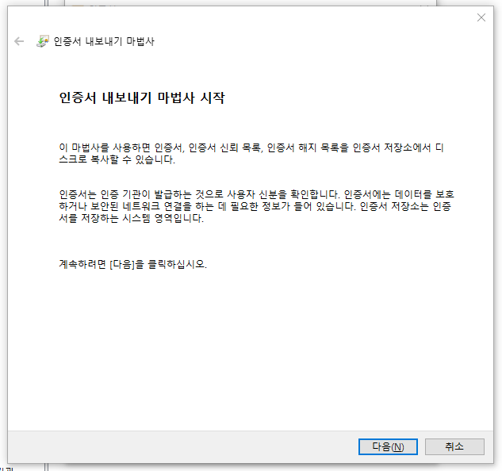
   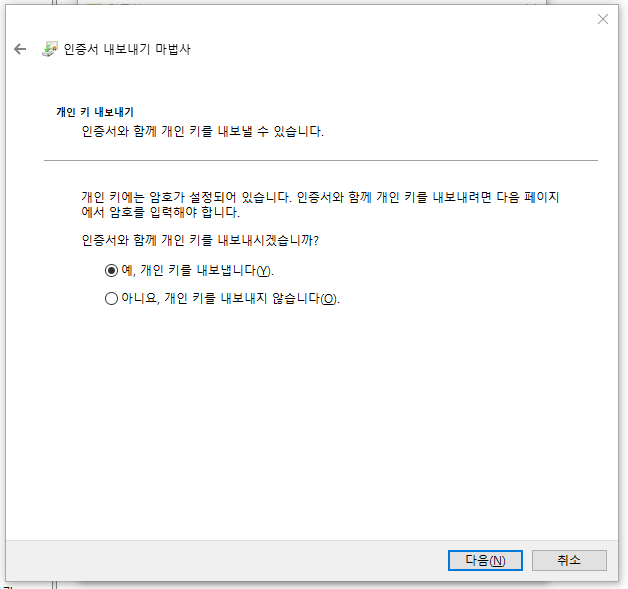
   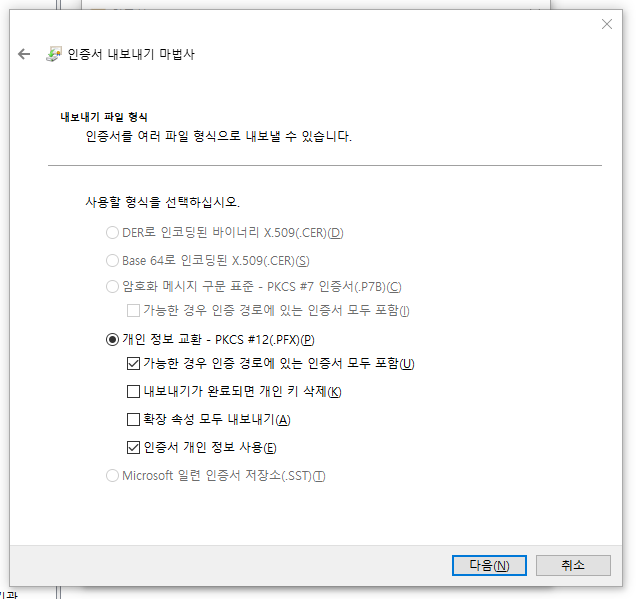
   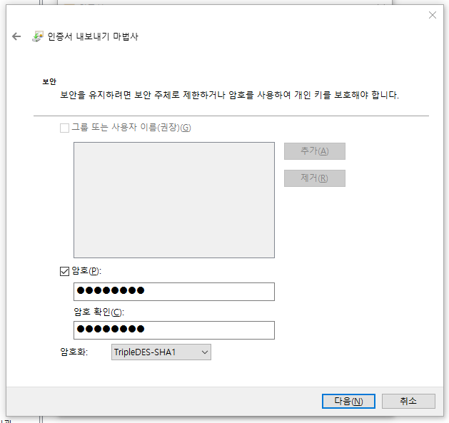
   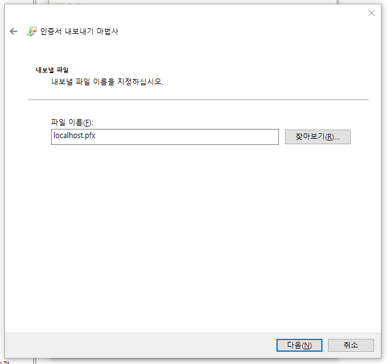
::: tip
자체 서명 인증서 발급 방법에 대해서는 아래의 주소를 참고  
[Windows](../dev-log/ssl)
:::
- crt, key 파일 추출
```bash
# 키 파일 추출
# [주의] PEM 패스워드를 지정하면, container 로 로딩시점에서 패스워드 입력을 요청하므로,
# 패스워드를 입력한 상태로 키 추출 후 패스워드 제거
$ openssl pkcs12 -in localhost.pfx -nocerts -out localhost_with_key.key
$ openssl rsa -in localhost_with_key.key -out localhost.key
# 인증서 파일 추출
$ openssl pkcs12 -in localhost.pfx -nokeys -clcerts -out localhost.crt
```
- `Nginx.Dockerfile` 수정
```docker{4-5}
FROM nginx:latest

COPY nginx.conf /etc/nginx/nginx.conf
COPY localhost.crt /etc/ssl/certs/localhost.crt
COPY localhost.key /etc/ssl/private/localhost.key
```
- `nginx.conf` 수정
```bash{12-40}
worker_processes auto;

events { worker_connections 2048; }

http {
  sendfile on;

  upstream web-api {
    server api_1:5000;
  }

  server {
    listen 80;
    server_name localhost;

    location / {
      return 301 https://$host$request_uri;
    }
  }

  server {
    listen 443 ssl;
    server_name localhost;

      ssl_certificate /etc/ssl/certs/localhost.crt;
      ssl_certificate_key /etc/ssl/private/localhost.key;

    location / {
      proxy_pass         http://web-api;
      proxy_redirect     off;
      proxy_http_version 1.1;
      proxy_cache_bypass $http_upgrade;
      proxy_set_header   Upgrade $http_upgrade;
      proxy_set_header   Connection keep-alive;
      proxy_set_header   Host $host;
      proxy_set_header   X-Real-IP $remote_addr;
      proxy_set_header   X-Forwarded-For $proxy_add_x_forwarded_for;
      proxy_set_header   X-Forwarded-Proto $scheme;
      proxy_set_header   X-Forwarded-Host $server_name;
    }
  }
}
```
::: danger
현재 외부에서 접속하는 http 포트를 4000 에 할당했기 때문에  
https 로 자동 리디렉션 하기 위한 방법 강구  

일반적인 80(http), 443(https) 로 할당하게 되면  
http 로 접근 시 https 로 자동 리디렉션 됨
:::

- `docker-compose.yml` 수정
```docker{24}
version: "3.7"

services:
  sql:
    image: mcr.microsoft.com/mssql/server:2019-latest
    ports:
      - "1433:1433"
    volumes:
      - "sql_data:/var/opt/mssql"
    environment:
      ACCEPT_EULA: "Y"
      SA_PASSWORD: "p@ssw0rd"
    restart: "no"

  nginx:
    depends_on:
      - sql
      - api_1
    build:
      context: ./Nginx
      dockerfile: Nginx.Dockerfile
    ports:
      - "4000:80"
      - "4001:443"
    restart: "no"

  api_1:
    depends_on:
      - sql
    build:
      context: ./todoCore3.Api
      dockerfile: Api.Dockerfile
    expose:
      - "5000"
    restart: "no"

volumes:
  sql_data:
```
- `docker-compose up`
```bash
$ docker-compose down
$ docker-compose build
$ docker-compose up -d
```
- 브라우저 테스트
   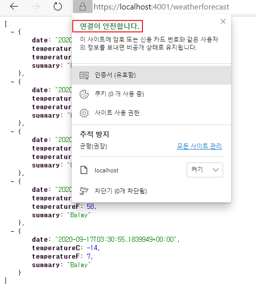
- **Postman** 테스트
   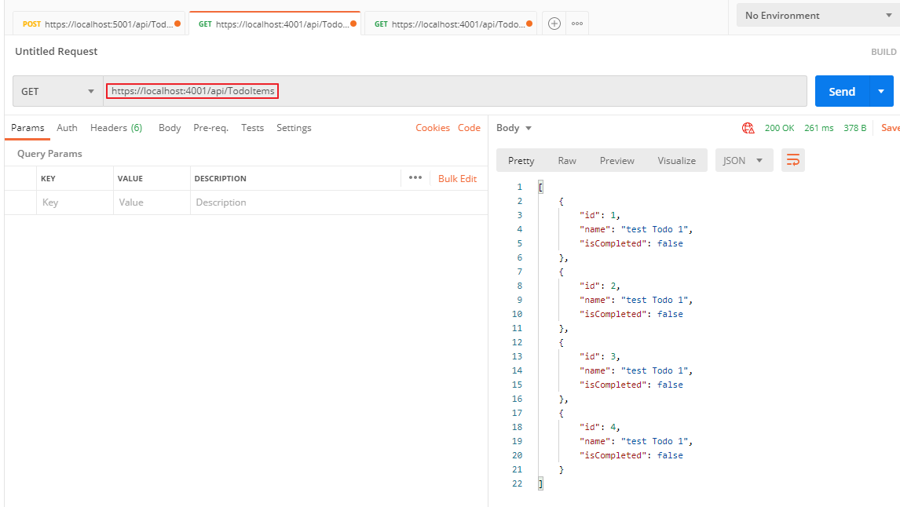
   
   

### Improvements & Fix

이제껏 만든 Api 에는 몇 가지 문제를 내포하고 있습니다. 개발 및 테스트 단계에서는 프로그래밍 방식으로 마이그레이션 하는 것이 생산성 측면에서는 좋을 수 있으나 프로덕션 레벨에서는 치명적인 문제를 발생시킬 수 있습니다.
- api 인스턴스를 여러 개 실행하는 경우  
   인스턴스들이 동시에 마이그레이션을 적용하려고 시도 및 실패 가능성
- CI 프로세스의 일부로서 배포 시나리오가 동작하는 경우 관리 용이성이 떨어짐
- 사전 검증 불가능으로 인한 데이터 유실의 위험

그 외에도 WebAPI endpoint 에 대한 과도한 정보 노출, 아키텍쳐 측면의 한계 등이 있을 수 있습니다.

일단 현 단계에서 개선 가능한 부분 몇 가지만 개선하고, 진행이 될 수록 추가적으로 개선해보는 방법으로 접근하겠습니다.
- SQL 스크립트를 통한 DB 마이그레이션 적용
- localhost 가 아닌 일반 도메인을 통한 SSL 적용
- DTO 시나리오 적용

### SQL migration script

- 마이그레이션 추가를 위해 `TodoItem` 모델에 TimeStamp 추가
```csharp{7-8}
  public class TodoItem
  {
    public long Id { get; set; }
    public string Name { get; set; }
    public bool IsCompleted { get; set; }

    [Timestamp]
    public byte[] RowVersion { get; set; }
  }
```
```bash
# 마이그레이션 추가
$ dotnet ef migrations add AddTimeStamp
# 마이그레이션 리스트
$ dotnet ef migrations list
$ dotnet ef migrations script --idempotent -o migrations01.sql
```
- `migrations01.sql` 확인
   idempotent 옵션은 각 마이그레이션 체크 후 실행될 수 있도록 스크립트 생성된다.
```sql
IF OBJECT_ID(N'[__EFMigrationsHistory]') IS NULL
BEGIN
    CREATE TABLE [__EFMigrationsHistory] (
        [MigrationId] nvarchar(150) NOT NULL,
        [ProductVersion] nvarchar(32) NOT NULL,
        CONSTRAINT [PK___EFMigrationsHistory] PRIMARY KEY ([MigrationId])
    );
END;

GO

IF NOT EXISTS(SELECT * FROM [__EFMigrationsHistory] WHERE [MigrationId] = N'20200909112636_CreateTodoItem')
BEGIN
    CREATE TABLE [TodoItems] (
        [Id] bigint NOT NULL IDENTITY,
        [Name] nvarchar(max) NULL,
        [IsCompleted] bit NOT NULL,
        CONSTRAINT [PK_TodoItems] PRIMARY KEY ([Id])
    );
END;

GO

IF NOT EXISTS(SELECT * FROM [__EFMigrationsHistory] WHERE [MigrationId] = N'20200909112636_CreateTodoItem')
BEGIN
    INSERT INTO [__EFMigrationsHistory] ([MigrationId], [ProductVersion])
    VALUES (N'20200909112636_CreateTodoItem', N'3.1.8');
END;

GO

IF NOT EXISTS(SELECT * FROM [__EFMigrationsHistory] WHERE [MigrationId] = N'20200912110359_AddTimeStamp')
BEGIN
    ALTER TABLE [TodoItems] ADD [RowVersion] rowversion NULL;
END;

GO

IF NOT EXISTS(SELECT * FROM [__EFMigrationsHistory] WHERE [MigrationId] = N'20200912110359_AddTimeStamp')
BEGIN
    INSERT INTO [__EFMigrationsHistory] ([MigrationId], [ProductVersion])
    VALUES (N'20200912110359_AddTimeStamp', N'3.1.8');
END;

GO
```
- `Startup.cs`에서 인스턴스 생성 시점에서 migration 하는 부분은 삭제
```csharp{4-12}
public void Configure(IApplicationBuilder app, IWebHostEnvironment env)
{
  ...
  //using (var serviceScope = app.ApplicationServices.GetRequiredService<IServiceScopeFactory>().CreateScope())
  //{
  //	var context = serviceScope.ServiceProvider.GetService<TodoContext>();

  //	if (context.Database.GetPendingMigrations().Any())
  //	{
  //		context.Database.Migrate();
  //	}
  //}
  ...
}
```
- 생성된 스크립트는 [Azure Data Studio](https://docs.microsoft.com/ko-kr/sql/azure-data-studio/download-azure-data-studio?view=sql-server-ver15) 혹은 [SSMS](https://docs.microsoft.com/ko-kr/sql/ssms/download-sql-server-management-studio-ssms?view=sql-server-ver15) 등으로 수동으로 마이그레이션 한다.
   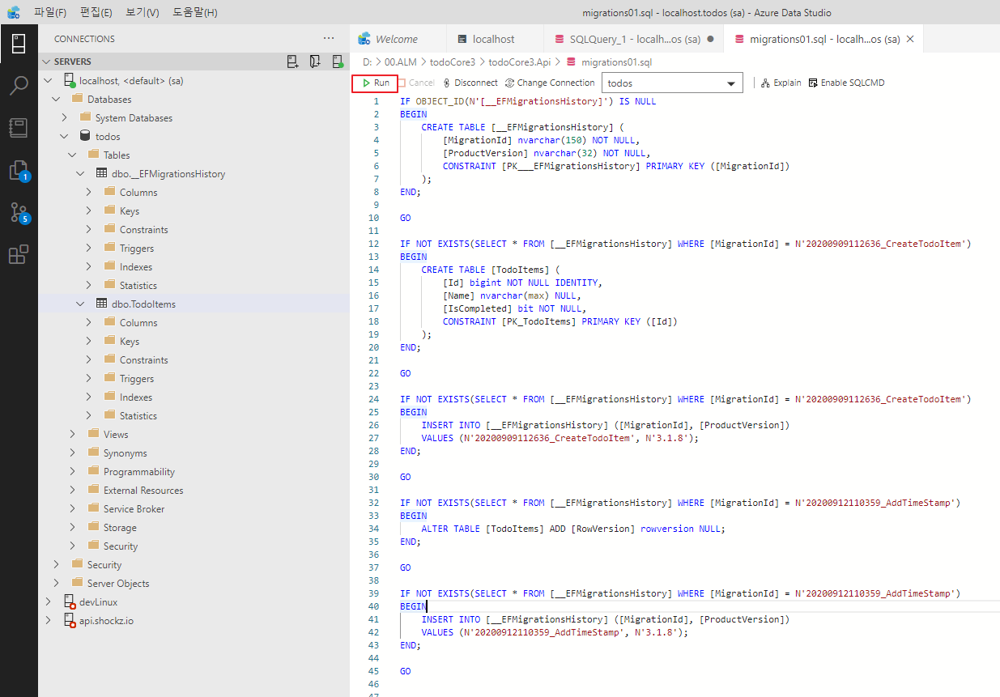
   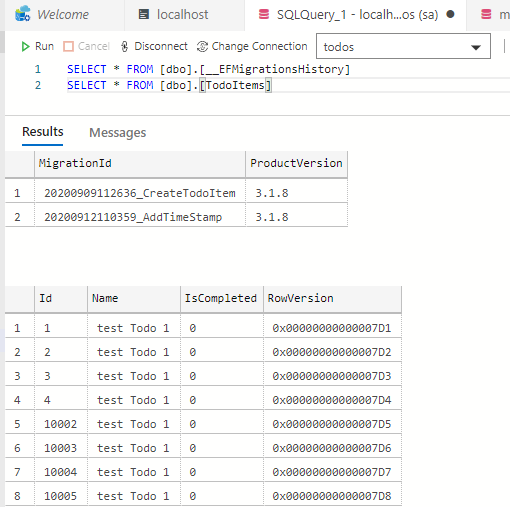
- docker-compose 다시 빌드 및 실행
```bash
$ docker-compose down
$ docker-compose up --build -d
```
- 마이그레이션 이후 Postman 등으로 테스트 하게 되면 추가된 필드를 확인할 수 있다.
   

### DTO 사용

- DTO(Data Transfer Object)를 사용하는 이유는 일반적으로 클라이언트에 보여지는 속성에 대한 제어를 하기 위함입니다.
- 추후 이 부분은 Automapper Profile 등으로 제어할 예정입니다.
- **Models** 에 TodoItemDTO를 추가합니다.
```csharp
public class TodoItemDTO
{
  public long Id { get; set; }
  public string Name { get; set; }
  public bool IsComplete { get; set; }
}
```
- `TodoItemController`의 전반적인 수정
```csharp{2, 4-9, 13-16, 20, 29, 34, 41-48, 54-57, 64-76, 80-92}
...
private bool TodoItemExists(long id) => _context.TodoItems.Any(e => e.Id == id);

private static TodoItemDTO ItemToDTO(TodoItem todoItem) => new TodoItemDTO
{
  Id = todoItem.Id,
  Name = todoItem.Name,
  IsComplete = todoItem.IsCompleted
};

// GET: api/TodoItems
[HttpGet]
public async Task<ActionResult<IEnumerable<TodoItemDTO>>> GetTodoItems()
{
  return await _context.TodoItems.Select(x => ItemToDTO(x)).ToListAsync();
}

// GET: api/TodoItems/5
[HttpGet("{id}")]
public async Task<ActionResult<TodoItemDTO>> GetTodoItem(long id)
{
  var todoItem = await _context.TodoItems.FindAsync(id);

  if (todoItem == null)
  {
    return NotFound();
  }

  return ItemToDTO(todoItem);
}

// PUT: api/TodoItems/5
[HttpPut("{id}")]
public async Task<IActionResult> UpdateTodoItem(long id, TodoItemDTO todoItemDTO)
{
  if (id != todoItemDTO.Id)
  {
    return BadRequest();
  }

  var todoItem = await _context.TodoItems.FindAsync(id);
  if (todoItem == null)
  {
    return NotFound();
  }

  todoItem.Name = todoItemDTO.Name;
  todoItem.IsCompleted = todoItemDTO.IsComplete;

  try
  {
    await _context.SaveChangesAsync();
  }
  catch (DbUpdateConcurrencyException) when (!TodoItemExists(id))
  {
    return NotFound();
  }

  return NoContent();
}

// POST: api/TodoItems
[HttpPost]
public async Task<ActionResult<TodoItem>> CreateTodoItem(TodoItemDTO todoItemDTO)
{
  var todoItem = new TodoItem
  {
    IsCompleted = todoItemDTO.IsComplete,
    Name = todoItemDTO.Name
  };

  _context.TodoItems.Add(todoItem);
  await _context.SaveChangesAsync();

  return CreatedAtAction(nameof(GetTodoItem), new { id = todoItem.Id }, ItemToDTO(todoItem));
}

// DELETE: api/TodoItems/5
[HttpDelete("{id}")]
public async Task<IActionResult> DeleteTodoItem(long id)
{
  var todoItem = await _context.TodoItems.FindAsync(id);
  if (todoItem == null)
  {
    return NotFound();
  }

  _context.TodoItems.Remove(todoItem);
  await _context.SaveChangesAsync();

  return NoContent();
}
...
```
- Postman 으로 확인해보면 DTO를 통한 데이터 전달로 변경됨을 확인할 수 있습니다.
   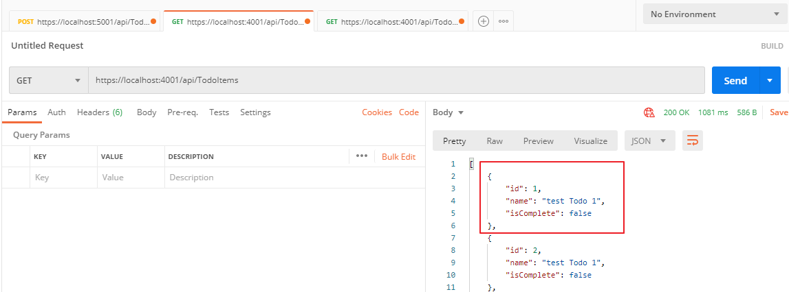

## Upcoming next

- nginx load-balancing
- Kubernates(k8s)
- Authentication
- DDD / CQRS
- Frontend (Vue.js)

## Reference

- [RealWorld](https://github.com/gothinkster/realworld)
- [자습서: ASP.NET Core를 사용하여 웹 API 만들기](https://docs.microsoft.com/ko-kr/aspnet/core/tutorials/first-web-api?view=aspnetcore-3.1&tabs=visual-studio)
- [마이그레이션 적용](https://docs.microsoft.com/ko-kr/ef/core/managing-schemas/migrations/applying?tabs=dotnet-core-cli)
- [자습서: 마이그레이션 기능 사용 - ASP.NET MVC 및 EF Core 사용](https://docs.microsoft.com/ko-kr/aspnet/core/data/ef-mvc/migrations?view=aspnetcore-3.1)
